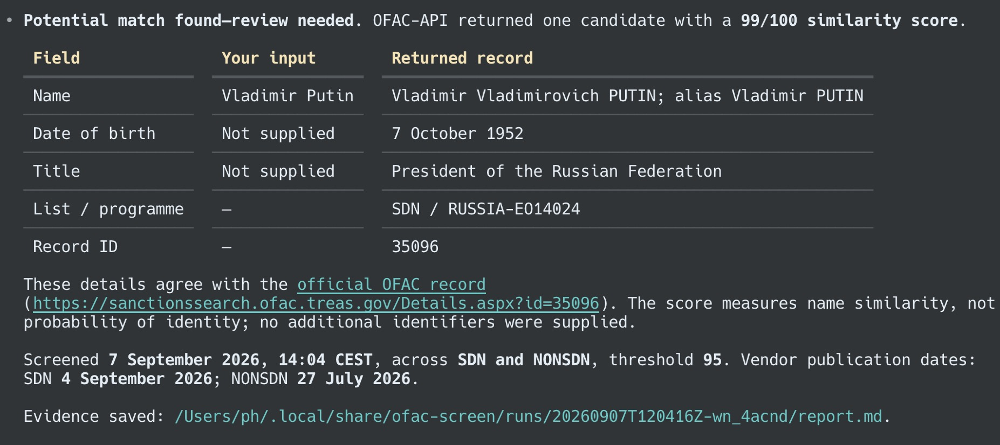

# OFAC screening

Check people or organisations against OFAC sanctions lists from your agent, with a dated report and the underlying matching evidence saved locally. Screen one payee or a batch of up to 500.

## Example

```text
/ofac-screen Vladimir Putin
```



Example output from 7 September 2026.

## Requirements

- An agent that can load skills, create local files and run Python commands.
- Python 3.10+ on macOS or Linux. No Python packages are required.
- An [OFAC-API.com account and API key](https://www.ofac-api.com/pricing). A limited trial is available; ongoing use requires a paid plan.
- Node.js/npm for the installation command below.

Configure the key as `OFAC_API_KEY` through your agent's environment or secret manager. Screening data is sent to OFAC-API.com and saved in local reports.

## Installation

```bash
npx skills add HartreeWorks/skill--ofac-screen
```

Restart your agent session if the new skill does not appear.

## Documentation

See [SKILL.md](./SKILL.md) for complete instructions, input fields and interpretation guidance.

## About

Created by [Peter Hartree](https://x.com/peterhartree) of [AI Wow](https://wow.pjh.is).

Find more skills at [HartreeWorks/skills](https://github.com/HartreeWorks/skills).
